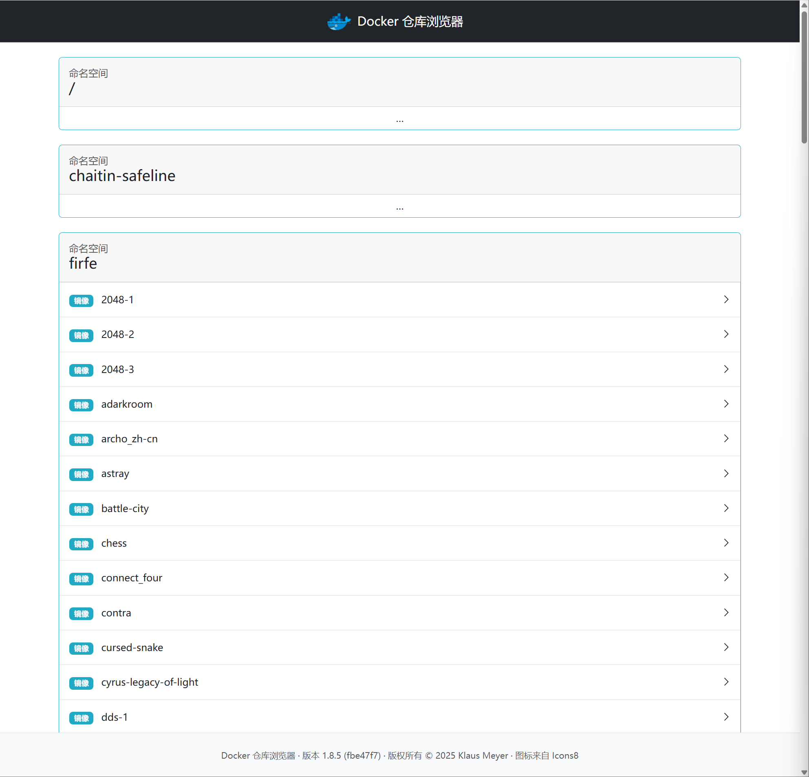
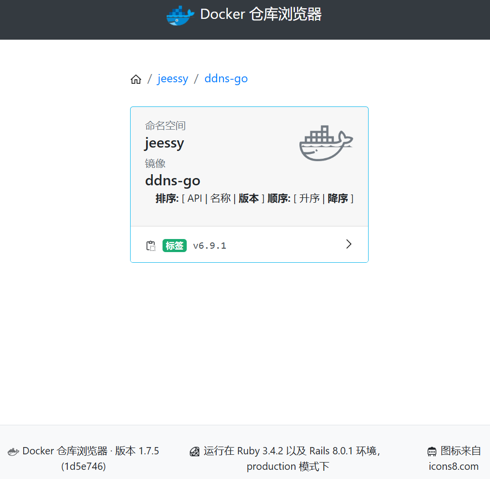
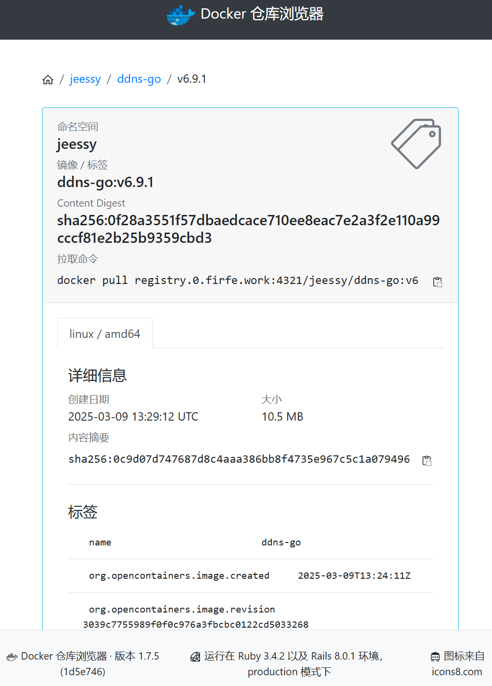
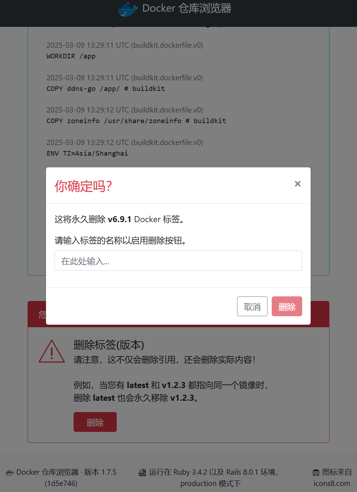

# Docker Registry Browser

基于 Ruby 和 Rails 编写的 [Docker Registry HTTP API V2](https://docs.docker.com/registry/spec/api/) 的网页界面。

## 汉化说明

当前汉化仅适用于 版本：1.8.1

首先感谢原作者的开源。[原项目地址](https://github.com/klausmeyer/docker-registry-browser)

具体汉化了那些内容，请参考[翻译说明](./翻译说明.md)。

我看不懂代码，所以只做汉化，有问题，请到原作者仓库处反馈。

这里汉化的不是源码，是从 docker 镜像中导出来的文件！

本人提供这个项目及`registry`在 NAS、服务器等的有偿远程部署服务。有需要可联系。  
微信号 `E-0_0-`  
闲鱼搜索用户 `明月人间`  
或者邮箱 `firfe163@163.com`  
如果这个项目有帮到你。欢迎 start。

有其他的项目的汉化需求，欢迎提 issue。或其他方式联系通知。

### 前端文件提取

```bash
docker run --rm \
  -u root \
  -e SECRET_KEY_BASE=klausmeyer_docker-registry-browser \
  -v ./views:/views \
  klausmeyer/docker-registry-browser:1.8.1 \
  sh -c "cp -rf /app/app/views/* /views/ && echo '✅ 文件已复制并覆盖，容器即将退出'"
```

### 部署汉化项目

> 部署这个项目的前提是要部署好`registry`这个镜像才可以！！！

1.  从仓库的 发行版(Releases)处下载汉化文件压缩包 `Source code (zip)`
2.  将压缩包解压，得到`views`文件夹
3.  在服务器上创建目录 `/docker/registry-browser`，或其他自定义目录
4.  将上面解压后的文件上传到设备上的 `/docker/registry-browser` 目录中
5.  更改文件权限，防止报错
    - 更改所有者
      ```bash
      chown -R 100:101 views
      ```
    - 更改权限
      ```bash
      chmod -R 755 views
      ```
    - 或者直接给最大权限
      ```bash
      chmod -R 777 views
      ```
6.  部署  
    在部署原项目`klausmeyer/docker-registry-browser:1.8.1`这个版本时，把上的文件`views`映射到日期中的`/app/app/views`
    - `compose.yaml`文件部署
      ```yaml
      services:
        registry-browser:
          container_name: registry-browser
          image: klausmeyer/docker-registry-browser:1.8.1
          network_mode: bridge
          restart: unless-stopped
          # 在部分NAS上如果部署报错，删除下面7行
          cpus: 1
          mem_limit: 512m
          logging:
            driver: json-file
            options:
              max-size: 1m
              max-file: "3"
          environment:
            TZ: Asia/Shanghai
            TIME_ZONE: Asia/Shanghai
            # 加密密钥，可自行替换
            SECRET_KEY_BASE: klausmeyer_docker-registry-browser
            DOCKER_REGISTRY_URL: registry的地址
            # 允许删除
            ENABLE_DELETE_IMAGES: true
            ENABLE_COLLAPSE_NAMESPACES: true
            PUBLIC_REGISTRY_URL: 镜像拉取地址前缀
          ports:
            - 8080:8080
          volumes:
            - /docker/registry-browser/views:/app/app/views
      ```

## 汉化效果截图

仓库概览



标签概览



标签详情



删除标签



# 原项目`README.md`文件翻译

## 截图

仓库概览

[](https://github.com/klausmeyer/docker-registry-browser/raw/master/docs/screenshot1.png)

标签概览

[](https://github.com/klausmeyer/docker-registry-browser/raw/master/docs/screenshot2.png)

标签详情

[](https://github.com/klausmeyer/docker-registry-browser/raw/master/docs/screenshot3.png)

删除标签

[](https://github.com/klausmeyer/docker-registry-browser/raw/master/docs/screenshot4.png)

## 使用方法

有关更多详细信息和可用的配置选项，请查看[文档](https://github.com/klausmeyer/docker-registry-browser/blob/master/docs/README.md)。

### Docker

```shell
$ docker run --name registry-browser -e SECRET_KEY_BASE=changeme -p 8080:8080 klausmeyer/docker-registry-browser
```

注意：`SECRET_KEY_BASE` 的值可以通过 `openssl rand -hex 64` 生成。

### Kubernetes (Helm)

Helm 图表可在 [klausmeyer/helm-charts](https://github.com/klausmeyer/helm-charts/tree/master/charts/docker-registry-browser) 获取。


## 许可证

该应用程序以 MIT 许可证的条款作为开源发布。

